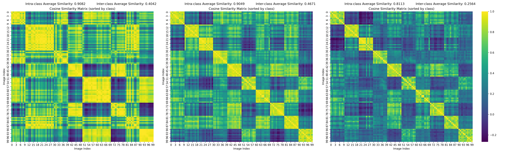
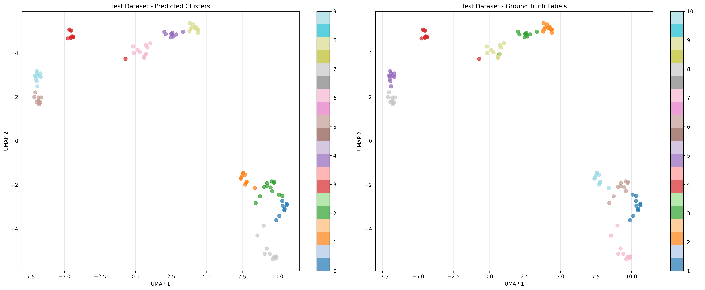
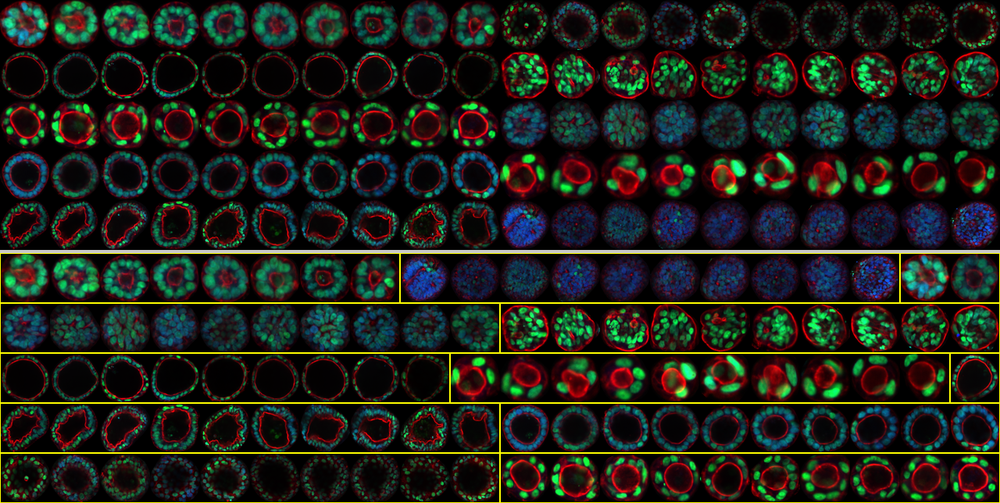
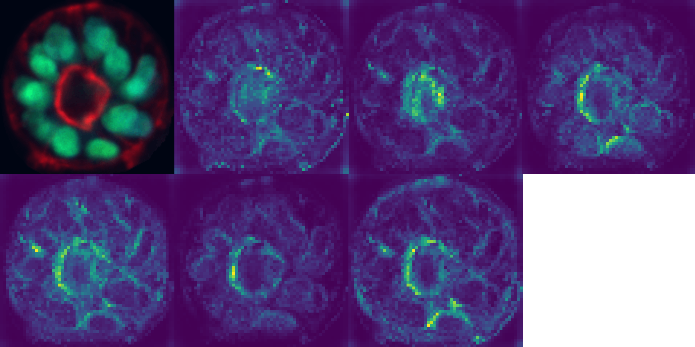

This is the research project for TU Dresden MLCV lab. 

[DINO](https://github.com/facebookresearch/dino)

[Correlation Clustering of Organoid Images](https://github.com/JannikPresberger/Correlation_Clustering_of_Organoid_Images/tree/main/code-twin-networks)

# Correlation Clustering for Organoid Images using DINO

This repository implements a novel framework for the systematic identification and categorization of organoid morphologies. By adapting **DINO** (Vision Transformer-based self-supervised learning) into a **Correlation Clustering** framework with **Twin Networks**, we enable high-throughput phenotyping without requiring a pre-defined number of clusters ($k$).

##  Overview

Organoids are essential miniaturized organ models for studying diseases and drug discovery. However, analyzing the massive datasets they generate poses a challenge: how to group them by morphological similarity without prior labels?

Our methodology addresses this by:

1. **Self-Supervised Feature Extraction:** Using DINO to learn rich visual representations from unlabeled organoid imagery.
2. **Similarity Learning:** A Twin Network architecture that predicts pairwise relationships (similar/dissimilar).
3. **Flexible Clustering:** Correlation Clustering (Multicut optimization) that automatically determines the optimal number of clusters.

---

##  Key Features

* **Self-Distillation (DINO):** Utilizes a Vision Transformer (ViT) backbone trained via self-distillation, eliminating the need for massive annotated datasets.
* **Twin Network Architecture:** A feature fusion mechanism that combines Hadamard products, absolute differences, and cosine similarity to quantify organoid relationships.
* **No  Required:** Unlike k-means, our correlation clustering approach finds the natural number of clusters based on edge weights.
* **Optimization Options:** Supports both greedy additive edge contraction (for speed) and Integer Linear Programming (ILP) via Gurobi (for optimality).

---

## Methodology

The pipeline consists of three main stages:

### 1. Self-Supervised Pre-training

We fine-tune a pre-trained DINO model on unlabeled organoid images. The "student" network learns from a "teacher" network (an exponential moving average of the student) using multi-crop data augmentation.

### 2. Twin Network Fine-tuning

The DINO backbone is integrated into a Twin Network. We use a Layer-wise Fine-tuning strategy:

* **Frozen:** Patch embeddings and the first 75% of Transformer blocks (to preserve general features).
* **Trainable:** Final 25% of blocks and a custom classification head.

### 3. Correlation Clustering

Similarity scores are converted into log-odds ratios:

$$c_{ij} = -\log\frac{1-s_{ij}}{s_{ij}}$$

The problem is solved as a Multicut Optimization task, partitioning the graph into coherent clusters that maximize agreement with the predicted similarities.

---

##  Experiments 

### 1. Feature Extraction (DINO)

We trained a ViT-S/16 backbone on 80,000 unlabeled organoid images to learn robust morphological features. The model successfully captures biological variations, creating a highly discriminative embedding space.

* **Architecture:** 12 Transformer blocks with 6 attention heads (~21M parameters).
* **Clustering Quality:** Achieved a high intra-class to inter-class similarity ratio (~3.16), significantly outperforming standard k-means in semantic coherence.
* **Evolution of Learning:** The heatmaps below demonstrate how the model progressively identifies distinct organoid phenotypes over 100 epochs.




### 2. Twin Network & Similarity Learning

The twin network was trained to predict whether image pairs belong to the same category. We conducted extensive trials to find the optimal architecture for non-linear feature interaction.

#### Feature Fusion Strategy

To overcome linear separability issues, we implemented a **DINO optimal** fusion approach. The input to the classification head includes:

* Raw Embeddings: $x_1, x_2$
* Hadamard Product: $x_1 \odot x_2$
* Absolute Difference: $|x_1 - x_2|$
* Cosine Similarity :   $\cos(x_1, x_2)$ 
* Euclidean Distance :  $\|x_1 - x_2\|_2$

We also implemented a **DINO simplified** fusion approach with only the raw embeddings, hadamard product and cosine similarity. So we have:

- **DINO optimal:** [$x_1, x_2$, $x_1 \odot x_2$, $\cos(x_1, x_2)$ , $|x_1 - x_2|$, $\|x_1 - x_2\|_2$]
- **DINO simplified:** [$x_1, x_2$, $x_1 \odot x_2$, $\cos(x_1, x_2)$ ]

---

## Results & Discussion

### 1. Clustering Visualization & UMAP Analysis

The framework demonstrates high fidelity in grouping organoids according to biological categories. The **UMAP visualization** confirms that the high-dimensional features extracted by the DINO-based network preserve the local neighborhood structure, resulting in clusters that align closely with ground truth labels.



For both seen (Test-100) and unseen (Test-30) organoid categories, the correlation clustering algorithm effectively partitions the graph into distinct morphological groups.

<div align="center">
    
</div>

### 2. Performance Comparison

Our **DINO-Optimal** configuration consistently outperforms the baseline Twin Network (TNI) and remains competitive with the augmented baseline (TNIa).

| Test Data |  | Model | RI | VI |  |  | PC | RC | PJ | RJ |  |
| --- | --- | --- | --- | --- | --- | --- | --- | --- | --- | --- | --- |
| **100** | 96.9 | TNIa | 99.4 | 0.14 | 0.09 | 0.05 | 99.6 | 99.8 | 97.7 | 96.0 | 99.7 |
|  | 90.4 | TNI | 98.2 | 0.38 | 0.18 | 0.20 | 99.1 | 98.9 | 89.5 | 91.3 | 99.0 |
|  | 91.7 | DINO optimal | 98.5 | 0.38 | 0.19 | 0.19 | 99.2 | 99.1 | 91.4 | 92.0 | 99.2 |
|  | 70.3 | DINO simplified | 94.5 | 1.25 | 0.65 | 0.60 | 97.2 | 96.8 | 68.9 | 71.8 | 97.0 |
| **30** | 68.6 | TNIa | 80.2 | 1.16 | 0.72 | 0.44 | 86.1 | 85.0 | 67.6 | 69.6 | 85.6 |
|  | 62.2 | TNI | 72.9 | 1.20 | 0.60 | 0.59 | 85.3 | 73.3 | 54.8 | 71.9 | 78.9 |
|  | 72.5 | DINO optimal | 80.7 | 0.83 | 0.32 | 0.51 | 90.9 | 80.0 | 64.9 | 82.2 | 85.1 |
|  | 66.7 | DINO simplified | 81.8 | 1.32 | 0.93 | 0.39 | 83.2 | 92.3 | 77.5 | 58.5 | 87.5 |
| **100/30** | 72.6 | TNIa | 95.3 | 0.88 | 0.27 | 0.61 | 99.2 | 95.8 | 61.2 | 89.2 | 97.4 |
|  | 68.5 | TNI | 94.7 | 1.09 | 0.38 | 0.72 | 98.7 | 95.5 | 58.3 | 83.1 | 97.1 |
|  | 69.2 | DINO optimal | 94.4 | 0.93 | 0.22 | 0.71 | 99.2 | 94.8 | 56.3 | 89.7 | 96.9 |
|  | 55.4 | DINO simplified | 92.3 | 1.80 | 0.71 | 1.09 | 97.6 | 94.0 | 46.4 | 68.7 | 95.8 |

> **Note:**
> * **100:** Performance on Test-100 (familiar classes).
> * **30:** Performance on Test-30 (unseen classes).
> * **100/30:** Combined performance of all subsets.
> * **RI:** Rand Index | **VI:** Variation of Information | **:** VI False Cuts | **:** VI False Joins
> * **PC/RC:** Precision/Recall of Cuts | **PJ/RJ:** Precision/Recall of Joins | **/:** F1 Score for Cuts/Joins.
> 
> 

> **Key takeaway:** The **DINO-Simplified** model generalizes better to unseen organoid categories (Test-30) than the optimal version. This suggests that a reduced feature set prevents overfitting to training-specific geometric patterns, relying instead on fundamental similarity relationships.


### 3. Key Insights & Discussion

* **Conservative Clustering Bias:** The model exhibits higher precision for "cuts" (>99%) than "joins" (~91%). This is due to a 10:1 class imbalance (more pairs are different than similar) and the fact that inter-class differences are biologically more pronounced than subtle intra-class variations.
* **Scalability:** While **Integer Linear Programming (ILP)** provides exact solutions for datasets < 300 images, we utilize **Greedy Additive Edge Contraction** and **Kernighan-Lin refinement** for larger sets (e.g., our 1,000-image unlabeled test) to ensure computational efficiency.

<div align="center">
    
</div>

### 4. Attention Analysis

Visualizing the Vision Transformer’s attention heads reveals how the model "sees" organoids.

* **Central Bias:** Most heads focus on the core region, capturing cellular density and differentiation patterns.
* **Multi-scale Detection:** Different heads capture various levels of detail—some focus on global structural integrity, while others detect localized cellular clusters.

<div align="center">
    
</div>

---

## Acknowledgments

The authors would like to express their sincere gratitude to Jannik Presberger and David Stein for their invaluable guidance and supervision throughout this research project.

We also acknowledge the use of artificial intelligence tools for language translation and text polishing in some parts of the report.

---

## References

[1] M. Caron *et al.*, "Emerging Properties in Self-Supervised Vision Transformers," *arXiv preprint arXiv:2104.14294*, 2021.

[2] M. Oquab *et al.*, "DINOv2: Learning Robust Visual Features without Supervision," *arXiv preprint arXiv:2304.07193*, 2024.

[3] J. Presberger, R. Keshara, D. Stein, Y. H. Kim, A. Grapin-Botton, and B. Andres, "Correlation Clustering of Organoid Images," *arXiv preprint arXiv:2403.13376*, 2024.

[4] R. Keshara, Y. H. Kim, and A. Grapin-Botton, "Organoid Imaging: Seeing Development and Function," *Annual Review of Cell and Developmental Biology*, vol. 38, pp. 447–466, Oct. 2022.

[5] E. A. Susaki and M. Takasato, "Perspective: Extending the Utility of Three-Dimensional Organoids by Tissue Clearing Technologies," *Frontiers in Cell and Developmental Biology*, vol. 9, p. 679226, Jun. 2021.

[6] F. Pampaloni, N. Ansari, and E. H. K. Stelzer, "High-resolution deep imaging of live cellular spheroids with light-sheet-based fluorescence microscopy," *Cell and Tissue Research*, vol. 352, no. 1, pp. 161–177, Apr. 2013.

[7] N. Bansal, A. Blum, and S. Chawla, "Correlation Clustering," *Machine Learning*, vol. 56, no. 1, pp. 89–113, Jul. 2004.

[8] A. Dosovitskiy *et al.*, "An Image is Worth 16x16 Words: Transformers for Image Recognition at Scale," *arXiv preprint arXiv:2010.11929*, 2021.

[9] J.-B. Grill *et al.*, "Bootstrap your own latent: A new approach to self-supervised Learning," *arXiv preprint arXiv:2006.07733*, 2020.

[10] M. Caron, I. Misra, J. Mairal, P. Goyal, P. Bojanowski, and A. Joulin, "Unsupervised Learning of Visual Features by Contrasting Cluster Assignments," *arXiv preprint arXiv:2006.09882*, 2021.

---

# Quick Start

## DINO training with organoid images
```
srun torchrun --nproc_per_node=4 main_dino.py \
    --arch vit_small \
    --data_path /projects/p_rep_learn_2/datasets \
    --output_dir $WORKSPACE_DIR/output \
    --saveckp_freq 20
```

## Twin network training using pretrained DINO checkpoints
```
srun python siamese_network.py \
    --model-name dino-p0.0 \
    --model-dir $WORKSPACE_DIR/models \
    --input-type dino \
    --embedding-dimension 384 \
    --augment 0.0 \
    --data-dir $TRAIN_DATA_PATH \
    --val-data-dir $VAL_DATA_PATH \
    --dino-checkpoint $DINO_CHECKPOINT \
    --dino-arch vit_small \
    --batch-size 32 \
    --val-batch-size 64 \
    --lr 0.002 \
    --total-steps 30000 \
    --steps-per-epoch 100 \
    --override
```
